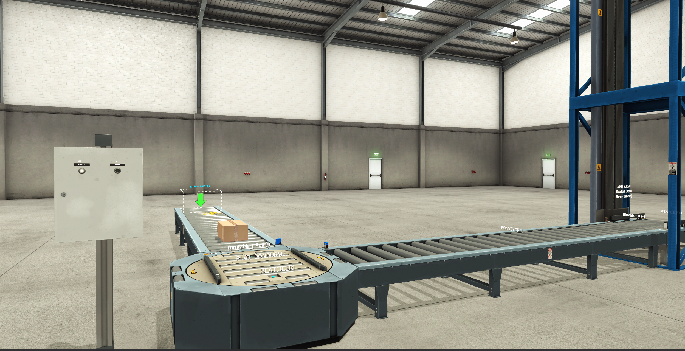
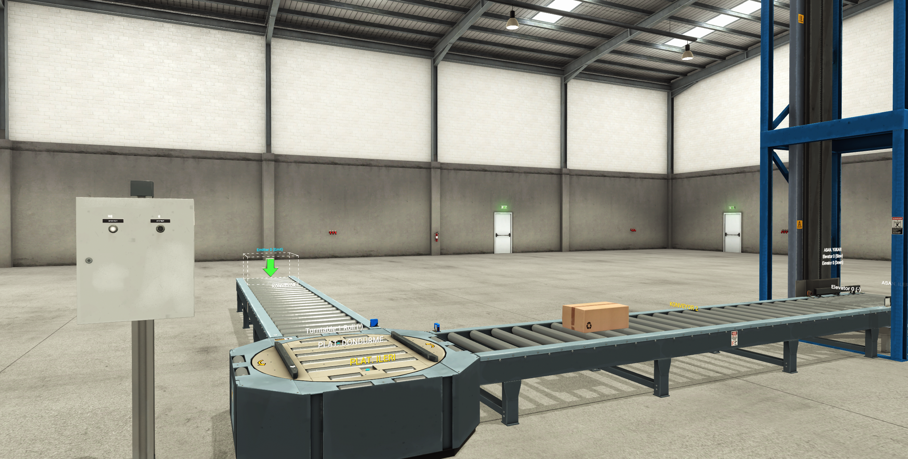
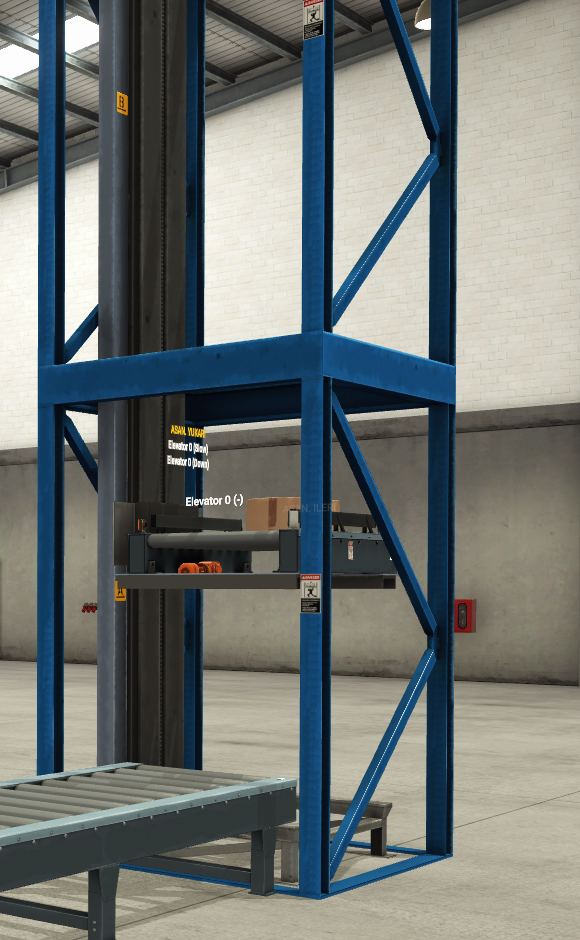
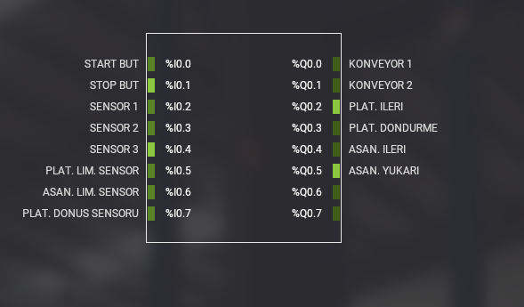
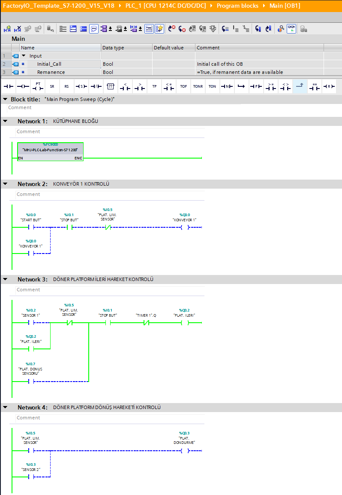
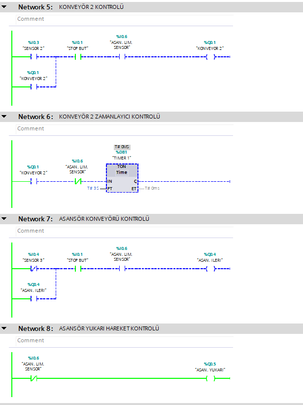
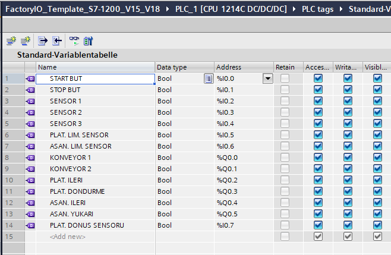

# Factory I/O İki Konveyörlü Asansör Otomasyon Sistemi

Bu projede Siemens S7-1200 PLC, TIA Portal V18 ve Factory I/O kullanılarak iki konveyör, döner platform ve asansörden oluşan bir taşıma sistemi kontrol edilmiştir. PLC programı Ladder (LAD) dilinde hazırlanmış ve sistem Factory I/O ortamında simüle edilmiştir.

## Kullanılan Teknolojiler

- Siemens S7-1200 PLC
- TIA Portal V18
- Ladder (LAD)
- Factory I/O
- PLCSIM
- Sensörler
- TON zamanlayıcı

## Sistem Yapısı

Sistem temel olarak aşağıdaki bölümlerden oluşmaktadır:

- Konveyör 1
- Döner platform
- Konveyör 2
- Asansör konveyörü
- Asansör
- Ürün algılama ve limit sensörleri

Ürün ilk konveyörden sisteme alınır. Sensörlerden gelen bilgilere göre döner platform kontrol edilir ve ürün ikinci konveyöre aktarılır. İkinci konveyör ürünü asansör bölümüne taşır. Asansör konveyörü ve asansör mekanizması kullanılarak ürün taşıma işlemi tamamlanır.

## Factory I/O Simülasyonu

### Ürün Girişi

Ürünün Konveyör 1 üzerinden sisteme giriş aşaması.

### Ürün Transferi

Ürünün döner platform üzerinden Konveyör 2'ye aktarılması ve asansör bölümüne taşınması.

### Asansör Sistemi

Ürünün asansör konveyörüne aktarılması ve asansör mekanizması ile taşınması.

## PLC I/O Bağlantıları

Factory I/O ile PLC arasındaki giriş ve çıkış adresleri eşleştirilmiştir.

## TIA Portal PLC Programı

PLC programı Ladder (LAD) dilinde hazırlanmıştır. Program içerisinde konveyörlerin, döner platformun ve asansör sisteminin kontrolü ayrı Network'ler halinde gerçekleştirilmiştir.

### Network 1 - Kütüphane Bloğu

Factory I/O ile PLC arasındaki haberleşmede kullanılan kütüphane bloğu çağrılmıştır.

### Network 2 - Konveyör 1 Kontrolü

Start ve Stop butonları ile Konveyör 1 kontrol edilir. Konveyör çıkışı üzerinden mühürleme yapılarak sistemin çalışmaya devam etmesi sağlanır.

### Network 3 - Döner Platform İleri Hareket Kontrolü

Sensörlerden ve platform limit sensörlerinden gelen sinyallere göre döner platformun ileri hareketi kontrol edilir.

### Network 4 - Döner Platform Dönüş Hareketi Kontrolü

Platformun dönüş hareketi ilgili sensör ve limit sensörü bilgilerine göre kontrol edilir.

### Network 5 - Konveyör 2 Kontrolü

Ürün ikinci konveyöre ulaştığında sensör bilgilerine göre Konveyör 2 çalıştırılır.

### Network 6 - Konveyör 2 Zamanlayıcı Kontrolü

Konveyör 2 ve asansör sistemi arasındaki çalışma sırasının kontrolü için TON zamanlayıcı kullanılmıştır.

### Network 7 - Asansör Konveyörü Kontrolü

Ürünün asansöre aktarılması için asansör konveyörü sensör bilgilerine göre kontrol edilir.

### Network 8 - Asansör Yukarı Hareket Kontrolü

Asansör limit sensöründen alınan bilgi kullanılarak asansörün yukarı hareketi kontrol edilir.

## PLC Tag Tablosu

Projede kullanılan dijital giriş ve çıkış adresleri TIA Portal PLC Tag tablosunda tanımlanmıştır.

## Proje Dosyası

Repository içerisinde TIA Portal V18 ile oluşturulmuş `.zap18` proje arşivi bulunmaktadır.

`factoryio-iki-konveyor-asansor-sistemi.zap18`
